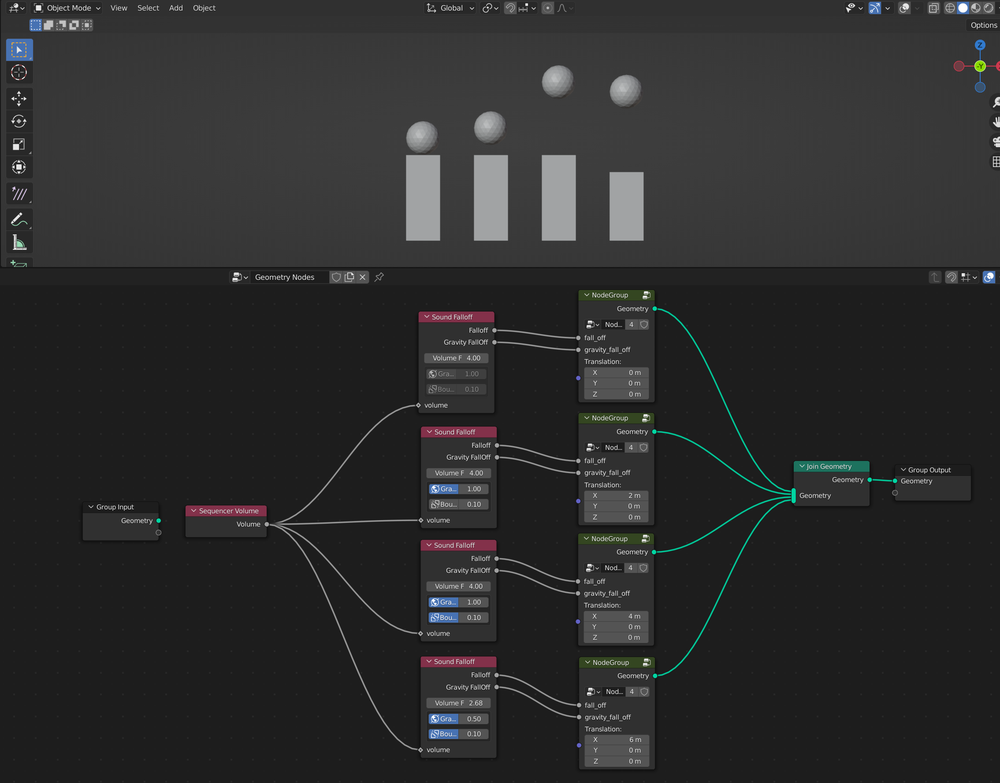
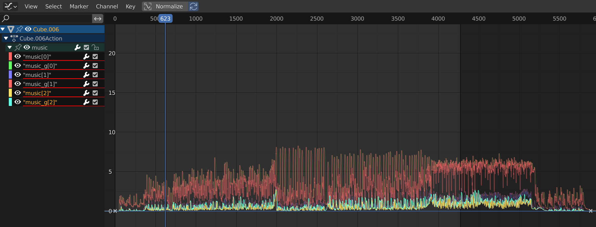

# ExtraGeometryNodes
Extra Blender Geometry Nodes

## Sound Falloff node
The sound falloff node cannot work alone.
You need to use bake_sound_to_fcurves.py first.

## More extra nodes
https://github.com/DB3D/ExtraNodes
