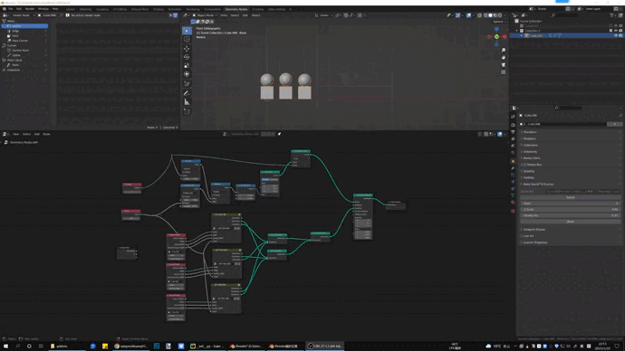

# ExtraGeometryNodes
Extra Blender Geometry Nodes

## Sound Falloff node
#### Features
1. Support Mutiply the volume
2. Support calculate the falloff gravity
3. When enable falloff gravity, support bounce falloff

#### Usage
1. Put a sound into the sequencer
2. Connect this node's input to Sequencer Volume node's output

Todo:
1. Divide sound to different parts according to frequency
2. Support as random instance(add more inputs)

## More extra nodes
https://github.com/DB3D/ExtraNodes
